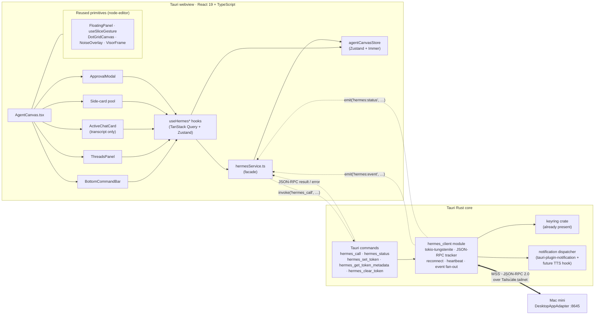
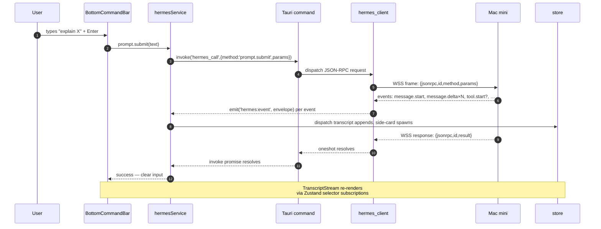
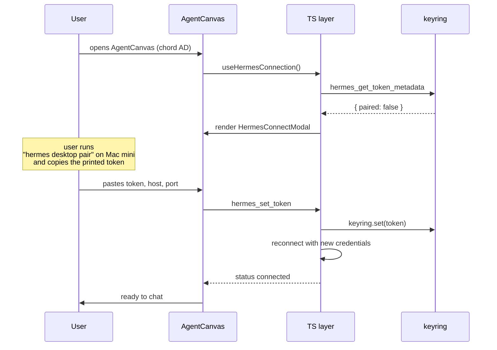

# Agent Canvas — Tauri client design (Hermes desktop adapter consumer)

## Context

This is the third of three coupled design docs:

| Doc | Side | Role |
|---|---|---|
| [desktop-app-adaptor.md](./desktop-app-adaptor.md) | Mac mini (Hermes) | New `DesktopAppAdapter` exposing `tui_gateway` over WSS |
| [tauri-client-contract.md](./tauri-client-contract.md) | Cross-repo | The JSON-RPC wire protocol — methods, events, error codes |
| **agent-canvas-design.md** *(this doc)* | **Windows (this Tauri app)** | **Client implementation: Rust WS layer, TS service, UI/UX, components** |

The Mac mini side is in flight; the contract is locked at `protocol_version = 1`. This document specifies how the Tauri app consumes that contract.

It does **not** redesign the wire protocol — that's [tauri-client-contract.md](./tauri-client-contract.md). It does **not** describe Hermes internals — that's [desktop-app-adaptor.md](./desktop-app-adaptor.md). It covers the Tauri-side: how the bytes that come off the WebSocket become a usable agent UI.

---

## Goals and non-goals

### Goals (v1)

1. A new `AgentCanvas` zone in the workspace, navigable by the chord `AD`.
2. Single active session at a time. The center "active chat" card is always *the* session.
3. Permanent bottom command bar: text input, slash autocomplete, mic, model picker. The only place the user types.
4. Side-cards for tool calls (long-running), artifacts (research, generated docs), subagent threads. Inline rendering for short tool calls and reasoning deltas.
5. Approvals as inline transcript cards + modal when the chat is focused + OS notification when unfocused.
6. "Save as note" path for artifact cards, integrated with the existing note service.
7. Slice gesture: main chat slice → end session; side-card slice → visual dismiss only.
8. Bearer-token auth via OS keyring (Windows Credential Manager). First-run modal + Preferences pane for re-pair/revoke.
9. Eager-on-app-start WebSocket connection so future notifications and TTS can fire when the canvas is closed.
10. Production-grade test discipline: TDD per established pattern; service unit tests, hook tests, component tests, Rust integration tests against a fake WS server.

### Non-goals (v1)

- Multi-session parallel UI. *(Single active session; threads list shows persisted history but you can only resume one at a time.)*
- Full voice in/out. *(The connection is wired so `voice.tts` and `voice.record` are reachable, but UI/audio routing is deferred.)*
- Generic file uploads. *(`attachment.upload` is contracted but a v2 UI concern; v1 supports text + slash commands + voice toggle only.)*
- Cross-repo protocol changes. *(If a feature requires a new RPC method, it goes in the adapter plan, not here.)*
- Multiple paired devices. *(One Tauri app = one paired client; pairing flow handles this.)*
- Re-attach to in-flight runs after disconnect. *(Per contract §13.3 — `session.resume` reads persisted history; live-stream re-attach is a future extension.)*

---

## Architecture overview



### Layered responsibilities

1. **Components** — pure rendering of store state; dispatch service calls on user actions. No direct knowledge of `invoke` or `listen`.
2. **Hooks (`useHermes*`)** — TanStack Query for read-shaped methods (`session.list`, `model.options`, `complete.slash`, `commands.catalog`); plain Zustand selectors for the streaming/transcript hot path (Query semantics don't fit sub-second deltas).
3. **`hermesService.ts`** — single TS facade. All UI code goes through it. Wraps `getInvoke()` (mock-friendly per the codebase pattern) and `listen()`.
4. **Tauri commands** — `hermes_call(method, params)` returns the JSON-RPC result; `hermes_set_token` / `hermes_get_token` / `hermes_clear_token` mirror the existing [session_credentials.rs](../../src-tauri/src/commands/session_credentials.rs) pattern; `hermes_status` returns connection state for status indicators.
5. **`hermes_client` Rust module** — owns the WSS connection (`tokio-tungstenite`), tracks JSON-RPC ids → response oneshots, runs reconnect with exponential backoff, sends pings, fans events out via `tokio::sync::broadcast`. Reads the token from keyring on connect; the token never returns to TS.
6. **Notification dispatcher** — subscribes to the broadcast channel, fires `tauri-plugin-notification` on `approval.request` / `message.complete` when the window is unfocused. This is the integration seam for the Qwen TTS sidecar later.

### Two transports between Rust and TS

- **Request/response:** `invoke('hermes_call', …)` — for every contract RPC method (`session.create`, `prompt.submit`, `slash.exec`, etc.). Promise resolves with the JSON-RPC `result` or rejects with the `error`.
- **Streaming events:** `listen('hermes:event', …)` — for every contract event (`message.delta`, `tool.start`, `approval.request`, …). Payload is the raw event envelope from the contract §2.3.

Both channels mirror the JSON-RPC wire shape 1:1. No reshaping in Rust. The contract is the type system.

---

## File layout

### New files (TypeScript)

```
src/
├── components/
│   └── agent-canvas/                              ← new module
│       ├── AgentCanvas.tsx                        ← top-level shell
│       ├── BottomCommandBar.tsx                   ← input + slash + mic + model
│       ├── ThreadsPanel.tsx                       ← toggleable session list
│       ├── ActiveChatCard.tsx                     ← transcript-only main card
│       ├── ApprovalModal.tsx                      ← focused approval UI
│       ├── side-cards/
│       │   ├── ToolProgressCard.tsx
│       │   ├── ArtifactCard.tsx                   ← save-as-note button
│       │   └── SubagentThreadCard.tsx
│       ├── transcript/
│       │   ├── TranscriptStream.tsx               ← message + reasoning + tool inline
│       │   ├── InlineToolBlock.tsx                ← short tool calls inline
│       │   └── InlineApprovalCard.tsx             ← always rendered + modal pairs to it
│       ├── slash/
│       │   ├── SlashCompletionMenu.tsx            ← autocomplete dropdown over complete.slash
│       │   └── ModelPickerDropdown.tsx            ← over model.options
│       ├── connection/
│       │   ├── HermesConnectModal.tsx             ← first-run pairing UI
│       │   └── HermesStatusIndicator.tsx          ← top-of-canvas dot + tooltip
│       └── types.ts                               ← AgentCanvas-local types
├── components/preferences/panes/
│   └── HermesPane.tsx                             ← new pane: status, re-pair, revoke
├── services/
│   └── hermesService.ts                           ← TS facade
├── hooks/
│   ├── useHermesConnection.ts
│   ├── useChatSession.ts
│   ├── useStreamingTurn.ts
│   ├── useSlashCompletion.ts
│   └── useHermesNotifications.ts                  ← OS notification dispatch on unfocused
├── stores/
│   └── agentCanvasStore.ts                        ← Zustand: transcript, sideCards, approvals
└── utils/
    └── sideCardHeuristics.ts                      ← tool name allowlist, output-size thresholds
```

### New files (Rust)

```
src-tauri/src/
├── hermes/
│   ├── mod.rs                                     ← module root
│   ├── client.rs                                  ← tokio-tungstenite WS connection
│   ├── rpc.rs                                     ← JSON-RPC id tracker, oneshot map
│   ├── reconnect.rs                               ← state machine + backoff
│   ├── notification.rs                            ← OS notification dispatcher
│   └── token.rs                                   ← keyring wrapper (mirrors session_credentials.rs)
└── commands/
    └── hermes.rs                                  ← #[tauri::command] surface
```

### Modified files

- `src-tauri/Cargo.toml` — add `tokio-tungstenite = { version = "0.21", features = ["rustls-tls-webpki-roots"] }`. (`keyring`, `tokio`, `serde_json`, `futures-util` already present.)
- `src-tauri/src/lib.rs` — register the new commands; spawn `hermes_client` task in the setup hook.
- `src-tauri/tauri.conf.json` — add `notification` permission if not present.
- `src/components/node-editor/components/CanvasBoard.tsx` — wire `AgentCanvas` as a zone (`AD` chord).
- `src/components/node-editor/WorkspaceCanvas.tsx` — same wiring (matches the GameHQ dual-wire pattern noted in CLAUDE.md memory).
- `src/components/preferences/PreferencesDialog.tsx` (or equivalent) — register `HermesPane` in the pane list.
- `src/components/node-editor/components/ChatPanel.tsx` — leave in place for v1 (still imported by `NodeEditorCanvasDark`); deletion is a follow-up cleanup task once we confirm nothing else references it.

### Reused primitives (no changes)

- [FloatingPanel.tsx](../../src/components/node-editor/components/FloatingPanel.tsx) — drag/resize/slice container.
- [useSliceGesture.ts](../../src/components/node-editor/hooks/useSliceGesture.ts) — slice detection.
- [DotGridCanvas.tsx](../../src/components/node-editor/components/DotGridCanvas.tsx) and [AnimeGridCanvas.tsx](../../src/components/node-editor/components/AnimeGridCanvas.tsx) — grid/particles backdrop.
- [NoiseOverlay.tsx](../../src/components/node-editor/components/NoiseOverlay.tsx) and [VisorFrame.tsx](../../src/components/node-editor/components/VisorFrame.tsx) — visual chrome.
- [InlineRadialMenu.tsx](../../src/components/node-editor/components/InlineRadialMenu.tsx) — right-click power menu on side-cards.

---

## Component breakdown

### `AgentCanvas.tsx`

The shell. Holds the canvas chrome (NoiseOverlay, dot/anime grid, visor) and renders:
- `ThreadsPanel` (left, toggled).
- `ActiveChatCard` (center, when a session is active).
- Side-card pool (anywhere on the canvas, draggable/resizable).
- `ApprovalModal` (overlay; only when the active chat card has window focus and an approval is pending).
- `BottomCommandBar` (sticky bottom, always rendered).
- `HermesStatusIndicator` (top-right corner).

State sources:
- `agentCanvasStore` for everything visible.
- `useHermesConnection()` for connection state (+ first-run modal trigger when no token).

What it does *not* do:
- Spawn cards on click. Cards are server-driven (per Q3 hybrid heuristic).
- Own slash-command parsing. That lives in `BottomCommandBar`.
- Implement physics. `FloatingPanel` does that.

### `BottomCommandBar.tsx`

The single source of input. Contains:
- `<textarea>` for prompt text. Enter submits unless Shift held.
- Slash trigger: typing `/` opens `SlashCompletionMenu` anchored to the bar.
- `+` button: future attachment menu (deferred — disabled in v1).
- Mic toggle: future voice (disabled in v1, present for layout fidelity).
- Model picker: shows current model name; click opens `ModelPickerDropdown` populated from `model.options`.
- "Ask permissions" indicator (left side): pending count of unanswered approvals; click jumps focus to the modal/inline card.
- Send arrow: equivalent to Enter.

Submission rules:
- If text starts with `/` → call `slash.exec` via `hermesService`.
- Otherwise → if no active session, call `session.create` first, then `prompt.submit`. If active, just `prompt.submit`.
- Disabled state when connection is not in `Connected`.

The bar does not display chat output. Output flows to `ActiveChatCard` (or to side-cards) via the event stream.

### `ThreadsPanel.tsx`

Toggleable left panel. Toggle via:
- Header button (top-left of the canvas, near the logo).
- Keyboard shortcut: `Ctrl+T` (Windows) / `Cmd+T` (macOS) when the agent zone is active.

Contents:
- `session.list` results, sorted by recency.
- Each row: title (or first user message preview), model used, last-active timestamp, message count.
- Click row → `session.resume(sessionId)` → swaps the active session in the store; `ActiveChatCard` shows the loaded transcript.
- Cross-platform sessions show a small badge (`telegram`, `cli`, `desktop_app`) — the contract guarantees they're all in `state.db`.

### `ActiveChatCard.tsx`

The center card. Wraps `FloatingPanel` for drag/resize/slice. Resize uses the same constraints as note cards (auto-height optional? — defer; v1 uses fixed-resize like a chat panel).

Contents (top to bottom):
- Header: session title (editable via `session.title`), model badge, close button.
- `TranscriptStream`: scrolls all events from the active session.
- (No input — the bottom bar is the only input.)

Slice rules (from Q6):
- Slice the card → confirm with a small toast → `session.close(sessionId)` → fade out → clear transcript and side-cards from this run.
- The session stays in `state.db` (it appears in the threads list afterward).

### Side-card flavors

Spawn rules — `sideCardHeuristics.ts` decides:

```ts
shouldSpawnCard(toolCall: ToolStartEvent): boolean
  // true if:
  //   tool name in LONG_RUNNING_ALLOWLIST (e.g. web_research, generate_image, file_write_large)
  //   OR tool emits a tool.progress event before completing
  //   OR tool output exceeds OUTPUT_INLINE_THRESHOLD (e.g. 800 chars)
  //   OR agent emits a btw.complete event
  // false otherwise (renders inline as InlineToolBlock)
```

#### `ToolProgressCard.tsx`
Auto-spawned for long-running tools. Live-updates from `tool.progress` and finalizes on `tool.complete`. Auto-fades 5 seconds after completion unless pinned via the radial menu.

#### `ArtifactCard.tsx`
For research write-ups, generated docs, or anything with `tool.complete.payload.output` over the threshold. Sticky until dismissed. Header includes:
- Save-as-note button (calls existing `noteService.create()` with markdown content; prompts for folder if none default).
- Pin button (prevents auto-fade; toggleable).
- Right-click → `InlineRadialMenu` for the same actions plus "Open expanded" and "Dismiss".

#### `SubagentThreadCard.tsx`
For `prompt.background` runs. Smaller chat-card lookalike showing the subagent's live message stream + final `btw.complete`. No input — the user can't talk to a subagent directly. Slice = visual dismiss; agent keeps running server-side.

### `ApprovalModal.tsx` and `InlineApprovalCard.tsx`

Per Q4 (option C):
- **Inline approval card** — renders in the transcript stream as a special bubble whenever an `approval.request` arrives. Three buttons: `Allow once / Always / Deny`. Persists in transcript history once answered (state changes from "pending" to "decided").
- **Modal** — pops over the active chat card iff the canvas is the focused workspace zone *and* the window has OS focus. Same buttons; clicking any button dismisses the modal *and* updates the inline card.
- **OS notification** — fires via `tauri-plugin-notification` from the Rust side when the `approval.request` event arrives and the window is unfocused. Click → focuses the window and opens the modal.

The Rust side handles the focus/notification decision based on a `window-focused` event from Tauri's window plugin. TS just renders.

### `HermesConnectModal.tsx`

First-run UI. Triggered when `hermes_get_token` returns `null` and the user lands on `AgentCanvas`. Steps:
1. Explain what's about to happen ("Pair this app with your Hermes host on the Mac mini").
2. Show the command to run on the Mac mini: `hermes desktop pair --client-name tony-windows-laptop`.
3. Paste field for the printed token. Validate length (>= 32 chars).
4. Optional host/port field (defaults: Tailscale IP from a config field, port 8645).
5. "Connect" button → `hermes_set_token` → reload connection → success or actionable error.

### `HermesPane.tsx`

Lives alongside the existing [AgentSDKsPane.tsx](../../src/components/preferences/panes/AgentSDKsPane.tsx). Shows:
- Connection status (live, reactive to `hermes:status` events).
- Paired host (host:port, masked token suffix).
- Re-pair button (re-opens `HermesConnectModal`).
- Revoke locally (`hermes_clear_token`; the user must also revoke server-side via `hermes desktop revoke`).
- Link to a help section on how to revoke server-side.
- Health check button → fires `GET /health` per contract §9; renders the response.

---

## Data flow

### Sending a prompt (happy path)



### Side-card spawn from tool event

```mermaid
sequenceDiagram
    participant SRV as Mac mini
    participant HC as hermes_client
    participant HS as hermesService
    participant ST as agentCanvasStore
    participant SCP as Side-card pool

    SRV->>HC: event tool.start{name:"web_research",args}
    HC->>HS: emit hermes:event
    HS->>ST: receive event → sideCardHeuristics.shouldSpawnCard()
    alt should spawn
        ST->>ST: append SideCard{kind:'tool-progress', toolCallId, name}
        ST->>SCP: render ToolProgressCard
    else inline
        ST->>ST: append transcript entry InlineToolBlock
    end
    SRV->>HC: event tool.progress{...}
    HC->>HS: emit
    HS->>ST: update existing card by toolCallId
    SRV->>HC: event tool.complete{...}
    HC->>HS: emit
    HS->>ST: mark card done; schedule auto-fade (5s) unless pinned
```

### Approval flow

```mermaid
sequenceDiagram
    participant SRV
    participant HC as hermes_client
    participant ND as notification dispatcher
    participant TS as TS layer
    participant U as User

    SRV->>HC: event approval.request
    par
        HC->>TS: emit hermes:event (always)
        TS->>TS: append InlineApprovalCard to transcript
        TS->>TS: if window focused → open ApprovalModal
    and
        HC->>ND: notify if window unfocused
        ND->>OS: tauri-plugin-notification.show()
    end
    U->>TS: clicks "Allow once"
    TS->>HC: invoke approval.respond(decision)
    HC->>SRV: WSS frame
    SRV-->>HC: result
    TS->>TS: update inline card to "Approved"; close modal
```

---

## Rust ↔ TS contract

### Tauri commands (TS → Rust)

| Command | Params | Returns | Purpose |
|---|---|---|---|
| `hermes_call` | `{ method: string, params: object }` | `{ result?: any, error?: { code, message } }` | Dispatches one JSON-RPC request; resolves when the server replies. |
| `hermes_status` | none | `{ state: 'disconnected' \| 'connecting' \| 'connected' \| 'reconnecting' \| 'error', last_error?: string, paired_host?: string, protocol_version?: number }` | Polled by status indicator and by `useHermesConnection`. |
| `hermes_set_token` | `{ token: string, host: string, port: number }` | `void` | Stores token + host in keyring; triggers reconnect. |
| `hermes_get_token_metadata` | none | `{ paired: boolean, host?: string, port?: number, token_suffix?: string }` *(never the full token)* | For the Preferences pane. |
| `hermes_clear_token` | none | `void` | Removes from keyring; closes current connection. |
| `hermes_health_check` | none | contract §9 health JSON | One-shot HTTPS GET to `/health`. |

### Tauri events (Rust → TS)

| Event | Payload | Trigger |
|---|---|---|
| `hermes:event` | full contract event envelope (`{ type, session_id, payload }`) | Every server-pushed event. |
| `hermes:status` | `{ state, last_error?, paired_host? }` | Connection state changes. |
| `hermes:error` | `{ code, message, context }` | Unrecoverable errors that warrant a UI toast. |

The `hermes:event` payload is the raw envelope from contract §2.3 — TS does the routing.

---

## Hermes client Rust module

State machine:

```
                ┌─────────────────┐
        (no    │  Disconnected   │
        token) │                 │ ◀───────────────┐
                └────────┬────────┘                 │
                         │ token set                │ clear / fatal
                         ▼                          │
                ┌─────────────────┐                 │
                │   Connecting    │ ───── error ────┘
                └────────┬────────┘
                         │ ws upgrade ok
                         ▼
                ┌─────────────────┐  drop / pong miss
                │   Connected     │ ──────────────┐
                └────────┬────────┘                ▼
                         │                ┌─────────────────┐
                         │ clear / quit    │  Reconnecting   │
                         ▼                │  (backoff)      │
                ┌─────────────────┐       └────────┬────────┘
                │  Disconnected   │ ◀──────────────┘
                └─────────────────┘
```

Key responsibilities:

- **Reconnect with exponential backoff** — 1s, 2s, 4s, 8s, … capped at 30s. Resets on successful `client.hello`.
- **Heartbeat** — per contract §8.3 the server sends pings every 30s; `tokio-tungstenite` auto-responds. No client-side keepalive needed. We do enforce a `pong miss` timeout (60s) that demotes `Connected → Reconnecting` to handle silent network drops.
- **JSON-RPC tracker** — `HashMap<u64, oneshot::Sender<RpcResult>>` keyed by request id. Drained on disconnect (all pending invokes reject with `connection_lost`).
- **Event broadcast** — `tokio::sync::broadcast::channel` with capacity 256. Subscribers: the Tauri event emitter and the notification dispatcher.
- **`client.hello` on connect** — sends the handshake from contract §3 with our capabilities; verifies `protocol_version == 1`. On mismatch, transitions to `Disconnected` with a fatal error.

Test harness: a `#[cfg(test)]` fake WS server bound to `127.0.0.1:0`, scripted to respond to `client.hello` and a few core RPC calls. Integration tests live alongside `client.rs`.

---

## Auth flow

### First-run



### Keyring layout

Following [session_credentials.rs](../../src-tauri/src/commands/session_credentials.rs):

| Service | User | Stores |
|---|---|---|
| `anandia-workspace-hermes` | `hermes-desktop-token` | bearer token (plaintext in keyring) |
| `anandia-workspace-hermes` | `hermes-desktop-host` | host string (e.g. `100.x.y.z` or hostname) |
| `anandia-workspace-hermes` | `hermes-desktop-port` | port number as string (default `8645`) |

The token never leaves Rust. `hermes_get_token_metadata` returns only the last 4 chars for UI display.

### Revocation

Two-sided:
1. **Local** — `hermes_clear_token` removes keyring entries and closes the connection. Future connect attempts fail until re-paired.
2. **Server** — user must run `hermes desktop revoke <client-name>` on the Mac mini. The Preferences pane links to a doc page explaining this.

The Preferences pane shows a "verify token still valid" health-check button that pings `/health` to detect server-side revocation per contract §13.4.

---

## Mock / dev mode

Following the established `getInvoke()` pattern:

```ts
// hermesService.ts
async function call<R>(method: string, params: object): Promise<R> {
  const invoke = getInvoke();
  if (invoke) return invoke('hermes_call', { method, params });
  return mockHermes.call(method, params); // emits scripted events too
}
```

`mockHermes` is a deterministic in-memory implementation with:
- A canned `session.list` returning two fake sessions.
- A scripted `prompt.submit` that emits `message.start` → 8 × `message.delta` → `message.complete` over 1.5s.
- A toggle to inject a `tool.start` (long-running) for testing card spawn.
- A toggle to inject an `approval.request` for testing the approval flow.

Lets the UI run end-to-end without a Mac mini, in browser preview mode, in Storybook (if added later), and in Vitest.

---

## Test strategy

Follows the project's TDD discipline (CLAUDE.md). New code lands test-first.

### Layers and test types

| Layer | Test type | Tool | Location |
|---|---|---|---|
| Rust `hermes_client` | Unit + integration | `cargo test` (with `#[cfg(test)]` fake WS server) | `src-tauri/src/hermes/*` |
| Rust commands | Unit | `cargo test` | `src-tauri/src/commands/hermes.rs` |
| `hermesService.ts` | Unit | Vitest, mocking `getInvoke` and `listen` | `src/services/hermesService.test.ts` |
| `useHermes*` hooks | Unit | Vitest + `@testing-library/react` | `src/hooks/useHermes*.test.ts` |
| `agentCanvasStore` | Unit | Vitest | `src/stores/agentCanvasStore.test.ts` |
| `sideCardHeuristics` | Unit | Vitest | `src/utils/sideCardHeuristics.test.ts` |
| Component tests | Component | Vitest + Testing Library | colocated `*.test.tsx` |
| E2E happy path | E2E | Playwright with mocked Tauri commands | `tests/e2e/agent-canvas.spec.ts` |

### Coverage commitments

- 80% line coverage threshold for the new TS modules (matching the project's existing threshold).
- All Rust modules have at least one integration test against the fake WS server.
- The four side-card spawn rules (allowlist, progress event, output size, btw.complete) each have a unit test.
- The approval flow has tests at all three levels: store, hook, component.

### Test fixtures

- `tests/fixtures/hermes-events.ts` — typed factory functions for every event in contract §5. Reused across unit and component tests.
- `src-tauri/src/hermes/test_server.rs` — fake WS server for Rust tests.
- `tests/e2e/fixtures/hermes-mock.ts` — Playwright route mocks for `hermes_call` / `hermes:event`.

### What we do *not* test in v1

- TLS cert pinning (deferred until WSS rollout in adapter Phase 3).
- Voice end-to-end (deferred — the methods are reachable but the UI is not).
- Multi-window or background-canvas scenarios beyond focus state.

---

## Phased delivery

Four phases, each shipped on its own branch. Each phase ends with a green CI run including coverage threshold.

### Phase A — Rust client + auth + status *(2-3 days)*

Goal: a connection that exists, authenticates, and reports state.

- `tokio-tungstenite` dep, `hermes_client` module skeleton, state machine, reconnect, heartbeat.
- `hermes_set_token` / `hermes_get_token_metadata` / `hermes_clear_token` commands (mirror `session_credentials.rs`).
- `hermes_call` command + JSON-RPC tracker + oneshot resolution.
- `hermes_status` command + `hermes:status` events.
- Notification dispatcher scaffold (no UI consumer yet — verify by logging).
- Tests: fake WS server fixture, `client.hello` round-trip, reconnect on drop, status transitions.

Acceptance: from a unit test, `hermes_call('client.hello', …)` succeeds; intentional drop triggers `Reconnecting` then `Connected`.

### Phase B — Service, hooks, store, mock *(2-3 days)*

Goal: TS layer can drive the Rust layer end-to-end against the mock.

- `hermesService.ts` with `call()`, `on()`, mock fallback.
- `agentCanvasStore` with transcript + side-card + approval shape.
- Hooks: `useHermesConnection`, `useChatSession`, `useStreamingTurn`, `useSlashCompletion`.
- Mock `mockHermes` scripted server.
- Tests: every hook + store covered; `sideCardHeuristics` unit tested.

Acceptance: a Vitest-rendered `BottomCommandBar` against the mock can submit a prompt and see deltas appear in `agentCanvasStore`.

### Phase C — Canvas shell + transcript + bottom bar + approvals *(3-4 days)*

Goal: usable agent UI for a single session against the real Mac mini.

- `AgentCanvas.tsx` shell with reused primitives.
- `BottomCommandBar.tsx` with text input, slash autocomplete, model picker.
- `ActiveChatCard.tsx` + `TranscriptStream.tsx` + `InlineToolBlock.tsx`.
- `ApprovalModal.tsx` + `InlineApprovalCard.tsx` + OS notification path.
- `HermesConnectModal.tsx` + `HermesPane.tsx`.
- Wire chord `AD` into both `WorkspaceCanvas` and `CanvasBoard`.
- Tests: component tests for each, E2E for the happy path.

Acceptance: open canvas → first-run modal → paste token → ask "explain X" → see streaming response. Approve a tool call. Slice the chat → session ends.

### Phase D — Side-cards, threads panel, save-as-note, polish *(2-3 days)*

Goal: full v1 feature parity with this spec.

- `ThreadsPanel.tsx` + toggle button + `Cmd/Ctrl+T` shortcut.
- `ToolProgressCard.tsx` / `ArtifactCard.tsx` / `SubagentThreadCard.tsx`.
- Save-as-note integration with existing `noteService`.
- Radial menu options (pin, save, dismiss, open expanded).
- `HermesStatusIndicator.tsx`.
- Auto-fade timer for completed tool-progress cards.
- Tests: card flavors, save-as-note round-trip, threads panel session resume.

Acceptance: a research-style prompt produces an artifact card; save-as-note creates a real note in the local DB.

**Total estimate**: ~10 working days.

---

## Open considerations

These are documented gaps to revisit after v1 ships. They're called out so they don't get rediscovered as surprises:

1. **Slash command output is text** (contract §13.1). Pickers like `/personality`, `/skills`, `/cron` render formatted text in the transcript. If the UX warrants native pickers (better than text), we widen the structured-data return surface in the adapter — that's a server-side change recorded in the adapter plan, not here.

2. **Admin commands** (`/restart`, `/update`) — passed through `slash.exec` for v1. UI gating behind an admin token (contract §13.2) is a future toggle in the Preferences pane.

3. **Live event re-attach** — disconnect mid-run loses the live stream (contract §13.3). v1 surfaces this as a status indicator change; resuming via `session.resume` shows persisted history but not the in-flight tail. A `session.observe` extension would close this gap.

4. **Forced disconnect on revoke** (contract §13.4) — server-side `hermes desktop revoke` doesn't drop the active socket. The status indicator's periodic `/health` probe (Phase D, every 30s) detects this and triggers a reconnect attempt that fails with 401, surfacing it to the UI.

5. **Voice in/out** — the connection supports `voice.toggle` / `voice.record` / `voice.tts`, but v1 hides the mic button behind a disabled state. Wiring the Qwen TTS sidecar into `voice.transcript` events for inbound playback is a separate piece of work that re-uses the notification dispatcher seam.

6. **Generic file attachments** — `attachment.upload` is contracted but v1 ships without it. Adding the `+` button menu and the upload progress indicator is incremental once Phase D is done.

7. **Multi-window / multi-zone**: the connection is one-per-app, regardless of how many windows or zones exist. If we ever want a second agent canvas in a separate window, the store needs a per-window namespace — out of scope for v1.

---

## Cross-references

- Server-side adapter plan: [desktop-app-adaptor.md](./desktop-app-adaptor.md)
- Wire-protocol contract: [tauri-client-contract.md](./tauri-client-contract.md)
- Existing keyring pattern: [session_credentials.rs](../../src-tauri/src/commands/session_credentials.rs)
- Reused canvas primitives: [FloatingPanel.tsx](../../src/components/node-editor/components/FloatingPanel.tsx), [useSliceGesture.ts](../../src/components/node-editor/hooks/useSliceGesture.ts), [DotGridCanvas.tsx](../../src/components/node-editor/components/DotGridCanvas.tsx), [NoiseOverlay.tsx](../../src/components/node-editor/components/NoiseOverlay.tsx), [VisorFrame.tsx](../../src/components/node-editor/components/VisorFrame.tsx), [InlineRadialMenu.tsx](../../src/components/node-editor/components/InlineRadialMenu.tsx)
- Reference fork: [LiquidError/hermes-agent — `feat/desktop-app-adaptor`](https://github.com/LiquidError/hermes-agent/tree/feat/desktop-app-adaptor)
