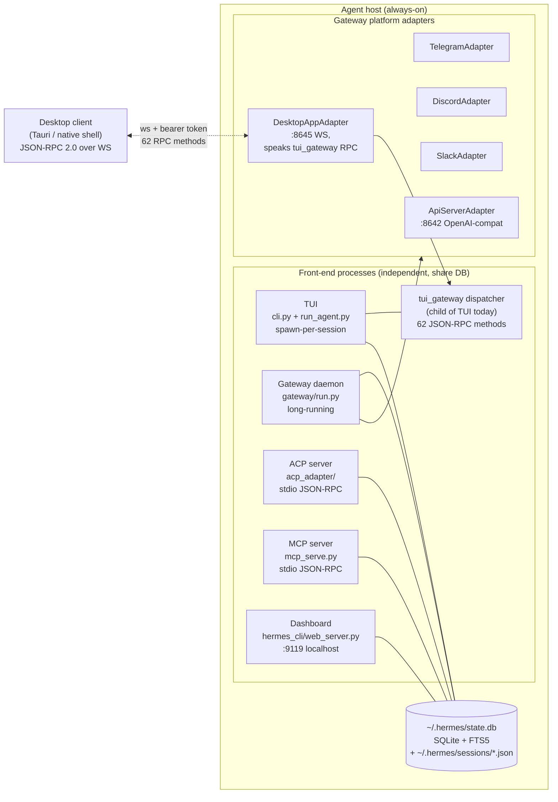
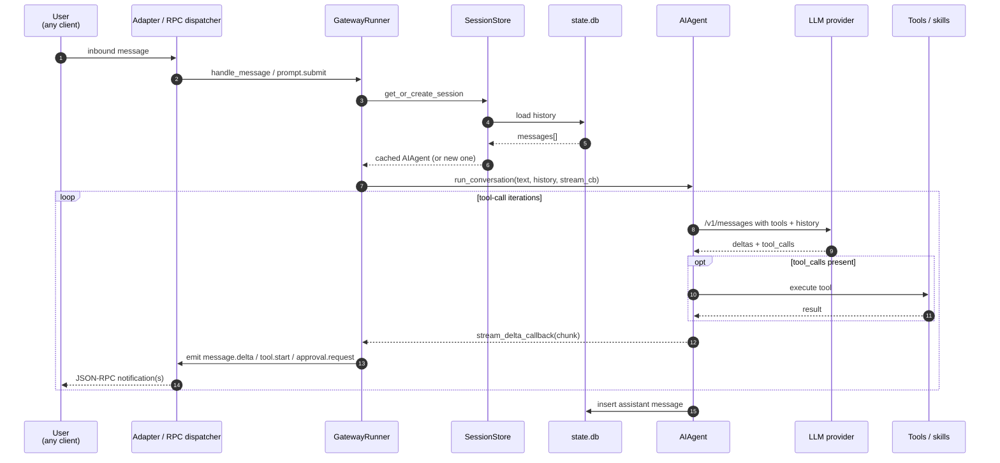
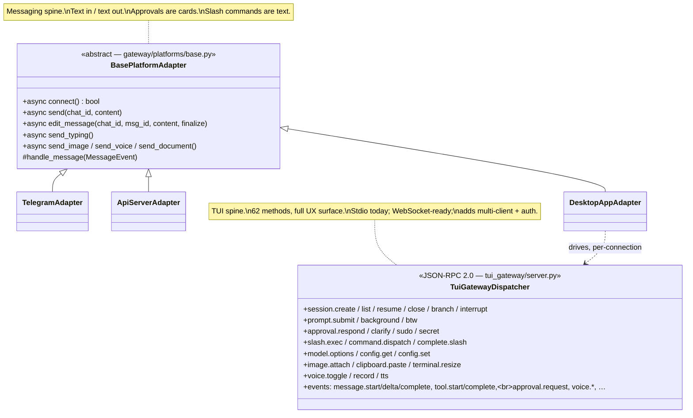
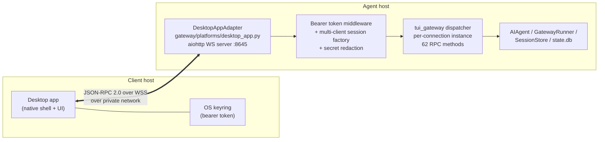

# DesktopAppAdapter — full-parity desktop client integration

## Context

The existing chat surfaces don't fit a daily-driver desktop UX:

- Telegram is fine for quick pings.
- The TUI is terminal-only.
- The web dashboard is config-focused.
- The OpenAI-compatible API server can carry chat but loses every Hermes-specific capability — approvals, slash commands, model pickers, voice, attachments, skills, sessions.

`DesktopAppAdapter` exposes the full Hermes RPC surface to a network desktop client (a separate Tauri app, in our deployment) over an authenticated WebSocket. This document covers the agent-host side — the new platform adapter, the protocol surface it exposes, and the architectural decisions behind it. The client implementation lives in its own repo.

Key architectural discovery: **the protocol you'd want to design for full TUI parity already exists inside Hermes as `tui_gateway`.** The adapter is a thin network exposure of that dispatcher with auth, multi-client isolation, and secret redaction added.

---

## Part 1 — Architecture

### 1.1 Two-sentence summary

Hermes is a Python agent whose **single source of truth** is `~/.hermes/state.db` (SQLite + FTS5) plus `~/.hermes/sessions/*.json` transcripts. **Multiple front-ends** — TUI, gateway daemon, ACP server, MCP server, dashboard — read and write that shared store, so a conversation started in Telegram can be resumed from the CLI and vice-versa. The unit of integration for messaging-style platforms is a **`BasePlatformAdapter`** subclass; the unit of integration for *full TUI parity* is the **`tui_gateway` JSON-RPC dispatcher**.

### 1.2 Process & state topology



**Key insight:** `tui_gateway` is *already* the protocol layer that drives the Hermes TUI. It exposes 62 JSON-RPC methods covering every TUI capability — sessions, prompts, streaming deltas, tool events, approvals, slash commands, voice, attachments, model switching, completion, config, insights. It speaks stdio to the local TUI process; the `ws.py` transport is feature-complete but not mounted on a network port. `DesktopAppAdapter` mounts it for remote use, hardens it for multi-client, and adds auth.

### 1.3 The agent loop & turn lifecycle (reference)



### 1.4 Session identity & cross-platform continuity

A session is keyed by `(platform, chat_id, thread_id)` — see [gateway/session.py:70](gateway/session.py:70). All adapters agree on this triple, write transcripts to `~/.hermes/sessions/{session_key}.json`, and persist via `state.db` (SQLite + WAL). Continuity across CLI / Telegram / desktop is achieved purely by **shared on-disk state** — no IPC sockets between front-ends. A new desktop adapter just picks a unique `Platform.DESKTOP_APP` enum value and the rest comes for free.

### 1.5 Two integration spines



**The two spines aren't competitors.** A messaging-style adapter (subclass of `BasePlatformAdapter`) is the right shape for "platforms Hermes can send to" (Telegram, Discord, etc.) — text in, text out, approvals as buttons in a chat. The `tui_gateway` dispatcher is the right shape for "clients that want the full TUI experience" — rich event stream, structured pickers, slash autocomplete, voice, attachments. A desktop client wants the second.

The pragmatic design is **`DesktopAppAdapter` as a thin network exposure of `tui_gateway`**:

- Register as `Platform.DESKTOP_APP` (so it lives in the gateway daemon, shares state.db, shows up in `/platforms`).
- On connect, instantiate a per-client `tui_gateway` dispatcher session.
- Forward JSON-RPC bidirectionally over a WebSocket.
- Add: bearer-token auth, multi-client session isolation, secret redaction.

### 1.6 The other interfaces, briefly

| Interface | Transport | Useful for full-parity desktop? |
|---|---|---|
| `mcp_serve.py` | stdio only | No |
| `acp_adapter/` (ACP) | stdio only | No (handles 7 slash commands) |
| `tui_gateway/` | stdio + WebSocket; **62 RPC methods, full TUI surface** | **Yes — protocol foundation** |
| `hermes_cli/web_server.py` | HTTP :9119 localhost, ephemeral session token | No (config UI, not chat) |
| `gateway/platforms/api_server.py` | HTTP+SSE :8642, bearer token | Backup / integration test target only |
| `gateway/platforms/webhook.py` | HTTP webhooks, HMAC | Possible for one-shot triggers |

### 1.7 Authentication that already exists

- **API server**: bearer token via `API_SERVER_KEY`, refuses non-loopback bind without a real key (8+ chars, no placeholders) — see [api_server.py:2602](gateway/platforms/api_server.py:2602).
- **Webhook adapter**: per-route HMAC secrets, idempotency cache, rate limiting.
- **Dashboard**: ephemeral in-memory token, localhost only.
- **`tui_gateway` itself: no auth.** Implicit trust because the TUI is a parent process. The single most important thing the adapter has to add to make it network-safe is a bearer-token check at the WS handshake.

---

## Part 2 — Why `tui_gateway` is the right foundation

The protocol that drives the Hermes TUI is already a clean JSON-RPC 2.0 dispatcher with 62 methods that map almost 1:1 onto what a desktop client needs.

### 2.1 What the existing dispatcher already covers

| Concern | Method(s) | File:line |
|---|---|---|
| Create / list / resume / close / branch / interrupt sessions | `session.create`, `session.list`, `session.resume`, `session.close`, `session.branch`, `session.interrupt` | [tui_gateway/server.py:1438](tui_gateway/server.py:1438), [:1568](tui_gateway/server.py:1568), [:1622](tui_gateway/server.py:1622), [:1784](tui_gateway/server.py:1784), [:1805](tui_gateway/server.py:1805), [:1857](tui_gateway/server.py:1857) |
| Submit a user message, stream the response | `prompt.submit` (emits `message.start` → many `message.delta` → `message.complete`) | [tui_gateway/server.py:2141](tui_gateway/server.py:2141), delta at [:2206](tui_gateway/server.py:2206) |
| Background tasks, ephemeral side-question (no tools) | `prompt.background`, `prompt.btw` | [:2448](tui_gateway/server.py:2448), [:2494](tui_gateway/server.py:2494) |
| Approval, clarify, sudo, secret prompts (and responses) | `approval.respond`, `clarify.respond`, `sudo.respond`, `secret.respond` (request comes via `approval.request` event) | [:2565](tui_gateway/server.py:2565), [:2550](tui_gateway/server.py:2550), [:2555](tui_gateway/server.py:2555), [:2560](tui_gateway/server.py:2560), event at [:1333](tui_gateway/server.py:1333) |
| Run a slash command | `slash.exec`, `command.dispatch`, `complete.slash` (autocomplete) | [:3802](tui_gateway/server.py:3802), [:3198](tui_gateway/server.py:3198), [:3654](tui_gateway/server.py:3654) |
| Switch model, list models, read/write config | `model.options`, `config.set`, `config.get` | [:3705](tui_gateway/server.py:3705), [:2590](tui_gateway/server.py:2590), [:2846](tui_gateway/server.py:2846) |
| Attach image, paste clipboard, resize terminal | `image.attach`, `clipboard.paste`, `terminal.resize` | [:2358](tui_gateway/server.py:2358), [:2319](tui_gateway/server.py:2319), [:2129](tui_gateway/server.py:2129) |
| Voice mode toggle, record audio, TTS playback | `voice.toggle`, `voice.record`, `voice.tts` | [:3899](tui_gateway/server.py:3899), [:3970](tui_gateway/server.py:3970), [:4022](tui_gateway/server.py:4022) |
| Tool lifecycle events | `tool.start`, `tool.complete` (server-pushed notifications) | [:978](tui_gateway/server.py:978), [:1013](tui_gateway/server.py:1013) |

### 2.2 Transport

- **stdio** is used by the actual TUI as a subprocess child (`tui_gateway/entry.py`).
- **WebSocket** transport exists at [tui_gateway/ws.py:112](tui_gateway/ws.py:112) — feature-complete because both transports share `dispatch()` at [tui_gateway/server.py:374](tui_gateway/server.py:374). The adapter mounts `handle_ws` as a WebSocket route on an aiohttp app; no changes to the dispatcher itself.

### 2.3 What the adapter adds for safe network deployment

These are bounded:

1. **Auth.** Bearer-token check at the WS handshake. Reject before reading any frame.
2. **Multi-client isolation.** `_sessions` dict at [server.py:117](tui_gateway/server.py:117) is shared globally by default. Per-connection dispatcher state ensures one client cannot interrupt another.
3. **Secret redaction in `config.get`.** Today config readouts include API keys verbatim; safe in a TUI parent process, dangerous over the wire. Mirror the dashboard's "reveal" pattern — keys masked by default, explicit reveal step.
4. **Per-method ACL.** Some methods (e.g. `config.set` on dangerous keys, `voice.tts` for arbitrary text) want either rate-limiting or a "destructive ops require confirmation" guard.
5. **Standalone server entry.** A way to start `tui_gateway` as a long-running network server, not as a stdio child of the TUI.

### 2.4 Why this is materially better than rolling a new protocol

- **Zero protocol design risk.** The Hermes maintainers already shipped this. It's tested by the TUI every day.
- **Free upgrades.** New TUI features land as new RPC methods. The desktop client gets them by speaking the same dispatcher.
- **Verbatim slash-command support.** `slash.exec` already runs CLI's `/personality`, `/model`, `/skills`, `/insights`, …, with `complete.slash` for autocomplete data. No re-implementing command parsing.
- **Approval flow is already a first-class RPC pair.** Telegram has to fake it via reply buttons; this adapter gets `approval.request` / `approval.respond` natively.
- **Voice & attachments already supported.** Including TTS playback events the desktop client can route to its own audio output.

---

## Part 3 — Slash command catalog & feature parity matrix

The full-parity bar means *every* `COMMAND_REGISTRY` entry plus dynamic skills works in the desktop client. Source of truth: [hermes_cli/commands.py:59-178](hermes_cli/commands.py:59).

### 3.1 The complete command list (62 built-ins + skills)

Grouped by what kind of UX work each one needs in the client:

#### Server-handled, no client UI work — pass through to `slash.exec`

Result is a text response that flows back as a `message.delta` stream.

`/new`, `/reset`, `/retry`, `/undo`, `/title`, `/branch`, `/fork`, `/compress`, `/rollback`, `/stop`, `/btw`, `/agents`, `/tasks`, `/queue`, `/q`, `/steer`, `/status`, `/help`, `/usage`, `/insights`, `/profile`, `/debug`, `/yolo`, `/reasoning`, `/fast`, `/voice`, `/reload-mcp`, `/snapshot`, `/snap`

These go through `slash.exec` exactly as the TUI uses today. Client just renders the text reply.

#### Server returns structured data, client renders a picker UI

Most "rich" commands. Client calls a query method, displays a dropdown/list, then calls `slash.exec` (or `config.set`) with the user's selection.

| Command | Query method | Action method |
|---|---|---|
| `/model` | `model.options` | `config.set` (or `slash.exec /model <id>`) |
| `/personality` | `slash.exec /personality` (parses list) | `slash.exec /personality <name>` |
| `/skills` | `slash.exec /skills list` (or scan via fs) | `slash.exec /skills <subcommand>` |
| `/sessions` (`/resume`) | `session.list` | `session.resume` |
| `/cron` | `slash.exec /cron list` | `slash.exec /cron <subcommand>` |
| `/tools` | `slash.exec /tools list` | `slash.exec /tools enable/disable …` |
| `/toolsets` | `slash.exec /toolsets` | text-driven |
| `/plugins` | `slash.exec /plugins` | text-driven |
| `/commands` | server-side built into TUI; `complete.slash` is good enough | — |
| `/platforms` (`/gateway`) | `slash.exec /platforms` | text-driven |

#### Client-only — implement with native OS APIs (don't go to the server)

Local-machine concerns; running them server-side either makes no sense remote or is a security risk.

- `/copy` — client clipboard: copy last assistant text.
- `/paste` — client clipboard: read image from clipboard, then call `image.attach`.
- `/image` — client file picker, then call `image.attach`.
- `/clear` — clear local transcript view; no server effect.
- `/skin` — local theme switcher.
- `/statusbar` (`/sb`) — toggle local status bar visibility.
- `/busy` — local Enter-key behavior pref.
- `/quit` (`/exit`) — close the client window.

#### Hybrid — server does the work, client provides better UX

- `/browser` — Hermes already integrates browser automation as a normal agent skill; the agent reaches for it the same way it reaches for any other tool. **No special wiring on either side**: the desktop client sees regular tool-call events (`tool.start` / `tool.complete`) and renders them like any other tool span.
- `/sethome` — gateway-only command for designating a home channel; meaningful for messaging platforms, less so for desktop. Make it a no-op or re-purpose to "make this client the default delivery target."
- `/restart`, `/update` — gateway daemon ops; only available to a privileged client. Hide from desktop UI by default; gate behind an admin token if exposed.
- `/approve`, `/deny` — already covered natively via `approval.request` / `approval.respond` events; no need to surface as text commands.

#### Skills as commands

Discovered via `scan_skill_commands()` at [agent/skill_commands.py:215](agent/skill_commands.py:215). Every `~/.hermes/skills/*/SKILL.md` becomes a `/skill-name` command. The client refreshes the list at startup and on `/reload`. Invocation goes through `slash.exec` — server handles everything.

### 3.2 Feature parity matrix

| Feature | TUI | Desktop client | Where it lives |
|---|---|---|---|
| Streaming text | ✅ | ✅ via `message.delta` | server |
| Tool-call timeline | ✅ | ✅ via `tool.start`/`tool.complete` | server |
| Approval prompts (allow-once / always / deny) | ✅ | ✅ via `approval.request`/`approval.respond` (modal cards in client) | both |
| Sudo / secret / clarify prompts | ✅ | ✅ via the four `*.respond` methods | both |
| Slash commands (all 60+) | ✅ | ✅ via `slash.exec` + autocomplete via `complete.slash` | server |
| Model picker | ✅ | ✅ client-rendered dropdown over `model.options` | both |
| Personality / skills / sessions / cron pickers | ✅ | ✅ client lists, `slash.exec` performs | both |
| Image attachment | ✅ | ✅ client file picker → `image.attach` | both |
| Clipboard paste-image | ✅ | ✅ client clipboard → `image.attach` | both |
| Voice in (STT) | ✅ | ✅ client mic capture → `voice.record` | both |
| Voice out (TTS) | ✅ | ✅ `voice.tts` events → client audio sink | both |
| Background tasks (`/bg`) | ✅ | ✅ via `prompt.background` | server |
| BTW (ephemeral, no-tools side question) | ✅ | ✅ via `prompt.btw` | server |
| Branching / forking | ✅ | ✅ via `session.branch` | server |
| Cross-platform session continuity | ✅ | ✅ inherits via `state.db` | server |
| Memory nudges, skill nudges | ✅ | ✅ surfaced as events | server |
| Multi-line editor, slash autocomplete | ✅ | ✅ client-side, fed by `complete.slash` | client |
| Conversation history view | ✅ | ✅ `session.resume` returns transcript | both |
| Token usage / insights / `/usage`, `/insights` | ✅ | ✅ via `slash.exec`; client can also render charts from structured data | both |
| Browser automation (`/browser`) | ✅ via skill | ✅ same skill, surfaced as normal tool events | server (skill) |
| Voice memo transcription on inbound | ✅ | ✅ inherits via the agent's transcription pipeline | server |

Every row is "✅ / ✅" — full parity is achievable through the existing dispatcher with no special-cased exceptions.

---

## Part 4 — Wire protocol & deployment

### 4.1 What the adapter is, in one diagram



### 4.2 The wire format

Vanilla JSON-RPC 2.0, exactly as `tui_gateway` already speaks it. The existing `dispatch()` at [tui_gateway/server.py:374](tui_gateway/server.py:374) returns the response shape; events are `{"jsonrpc":"2.0","method":"event","params":{"type":"...","session_id":"...","payload":{...}}}` notifications. Nothing is redesigned; the adapter routes. The only addition is a connection-level handshake:

```jsonc
// Client → Server, first message after WS open
{"jsonrpc":"2.0","id":1,"method":"client.hello","params":{
  "client_id":"<client-name>",
  "client_version":"0.1.0",
  "capabilities":["voice.in","voice.out","attach.image","attach.clipboard","widget.render"]
}}
// Server → Client
{"jsonrpc":"2.0","id":1,"result":{
  "server_version":"hermes-0.x.y",
  "protocol_version":1,
  "session_namespace":"<per-client-uuid>",
  "capabilities":["voice","tts","approval","skills","insights","widget.render"]
}}
```

After that, every other message is one of the existing methods or one of the existing event notifications.

### 4.3 Auth model

- **Bearer token at the WebSocket handshake** (`Authorization: Bearer <token>` request header). Reject before reading any frame.
- **Token storage on the agent host**: `~/.hermes/desktop_app_tokens.json` (one row per paired client; can revoke per-client). Tokens are stored hashed; the plaintext is shown once at pairing time and never again.
- **Pairing**: the user generates a token via `hermes desktop pair --client-name <name>`, copies the token into the desktop app once. The desktop app stores it in the OS keyring (Keychain / Credential Manager / Secret Service).
- **Network**: bind to a private-network IP (e.g. a Tailscale tailnet IP) only. No port-forwarding through a home router. SSH tunnel is a viable fallback.
- **TLS**: aiohttp serves WSS directly with a private-CA cert; recommended for any non-loopback bind.

### 4.4 Multi-client session isolation

Today `tui_gateway` keeps a single `_sessions` dict and assumes one TUI client. For desktop usage:

- Each WS connection gets a per-connection dispatcher instance (cheap; the dispatcher state is mostly a couple of dicts) **OR** a shared dispatcher with namespaced session ids.
- Per-connection dispatcher is cleaner: no risk of one client interrupting another's run by id-collision.
- Sessions persisted to `state.db` are still shared across connections (so reconnecting picks up your conversation), but in-flight RPC state isn't.

### 4.5 Secret redaction

[hermes_cli/web_server.py](hermes_cli/web_server.py) already has a "reveal a secret with rate limiting" pattern. Mirror it: by default `config.get` masks API keys (`sk-…ABCD`); a separate `config.reveal_secret` method requires recent re-auth (or admin token) to return the real value. Apply the same to anything in env / api_keys / tokens space.

### 4.6 Deployment

- New file: `gateway/platforms/desktop_app.py` — subclass `BasePlatformAdapter`, overrides `connect`/`disconnect` to start the aiohttp WS server, owns the per-connection dispatcher pool, owns the auth middleware. Inbound `prompt.submit` translates to `MessageEvent` for accounting / `/platforms` visibility while still dispatching through `tui_gateway` for the rich event stream.
- Enum entry: `Platform.DESKTOP_APP = "desktop_app"` in [gateway/config.py](gateway/config.py).
- Factory branch: in [gateway/run.py:_create_adapter](gateway/run.py).
- Env vars: `DESKTOP_APP_ENABLED`, `DESKTOP_APP_HOST`, `DESKTOP_APP_PORT`, `DESKTOP_APP_TOKEN_FILE`.
- System-prompt hint: in [agent/prompt_builder.py](agent/prompt_builder.py) — `desktop_app` entry in `PLATFORM_HINTS`.
- Refuse-to-start guard: same shape as `api_server.py:2602` — non-loopback bind requires a real token file with at least one entry.

### 4.7 CLI: pairing, listing, revoking

```
hermes desktop pair --client-name <name>   # mints a token, prints once
hermes desktop list                        # lists paired clients
hermes desktop revoke <name>               # removes a paired client
```

`hermes doctor` surfaces DesktopAppAdapter status (enabled? bound to which host:port? paired client count, last-seen timestamps).

### 4.8 Reconnect semantics

- In-flight runs continue server-side when the WebSocket drops.
- On reconnect, the client calls `session.resume <session_id>` to re-attach to the live event stream; the next `message.delta` arrives without resending the prompt.
- Per-client tokens persist across reconnects; revoking a token closes any live connection bound to it.

---

## Critical files referenced

| Concern | File |
|---|---|
| Agent loop | [run_agent.py](run_agent.py) |
| Session persistence | [hermes_state.py](hermes_state.py) |
| Gateway coordinator | [gateway/run.py](gateway/run.py) |
| Session store / identity | [gateway/session.py](gateway/session.py) |
| Adapter base class | [gateway/platforms/base.py](gateway/platforms/base.py) |
| Existing HTTP adapter (auth-pattern reference) | [gateway/platforms/api_server.py](gateway/platforms/api_server.py) |
| Stream consumer | [gateway/stream_consumer.py](gateway/stream_consumer.py) |
| Telegram adapter (BasePlatformAdapter reference impl) | [gateway/platforms/telegram.py](gateway/platforms/telegram.py) |
| **`tui_gateway` dispatcher (the protocol foundation)** | [tui_gateway/server.py](tui_gateway/server.py) |
| `tui_gateway` WebSocket transport (mounted by the adapter) | [tui_gateway/ws.py](tui_gateway/ws.py) |
| `tui_gateway` stdio transport (TUI's path) | [tui_gateway/entry.py](tui_gateway/entry.py), [tui_gateway/transport.py](tui_gateway/transport.py) |
| Slash command registry | [hermes_cli/commands.py](hermes_cli/commands.py) |
| CLI command dispatch | [cli.py](cli.py) |
| Gateway command dispatch | [gateway/run.py](gateway/run.py) |
| Skill command discovery | [agent/skill_commands.py](agent/skill_commands.py) |
| Approval origin in agent loop | [tools/approval.py](tools/approval.py) |
| Approval gateway state | [gateway/run.py](gateway/run.py) |
| MCP server (approval API reference) | [mcp_serve.py](mcp_serve.py) |
| Dashboard secret-reveal pattern (model for redaction) | [hermes_cli/web_server.py](hermes_cli/web_server.py) |
