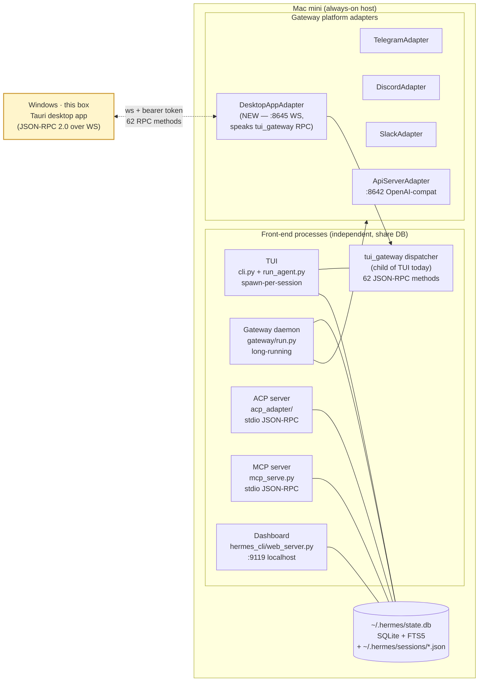
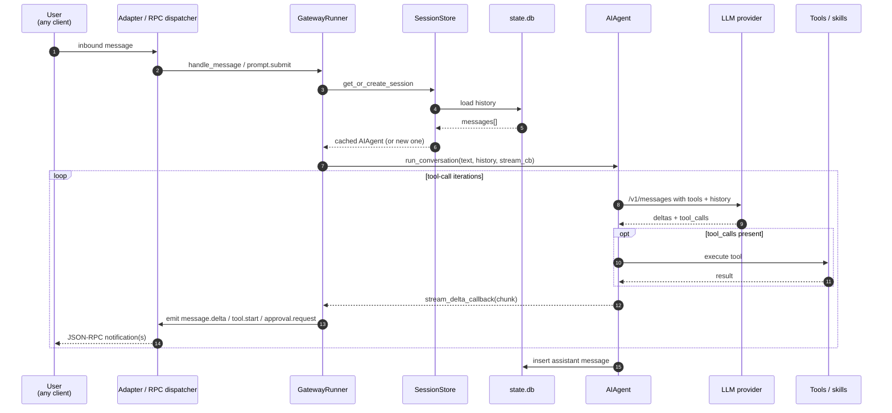
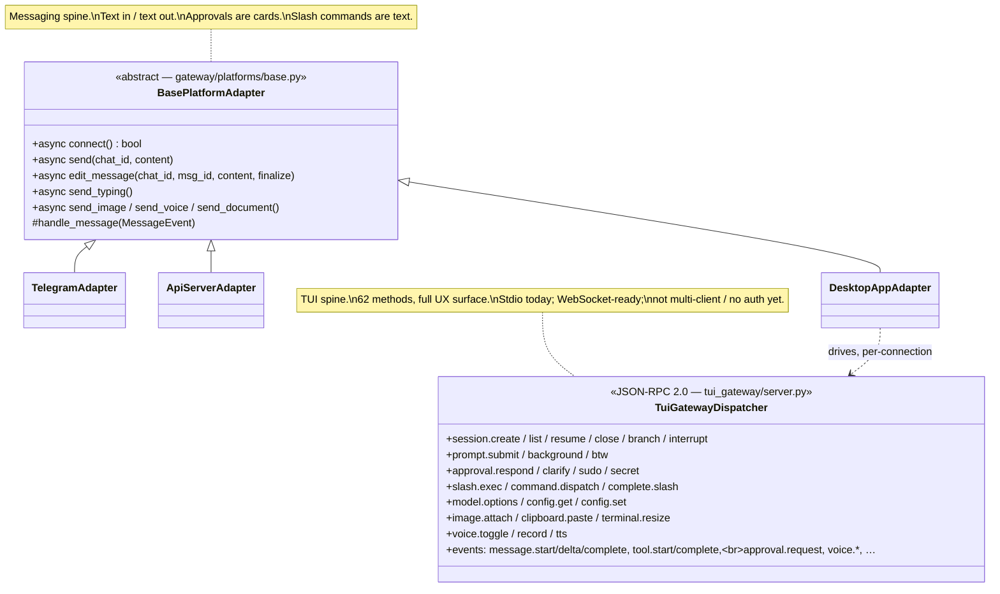
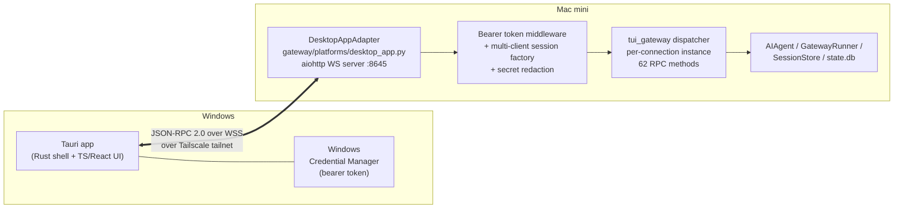

# Hermes Agent — full-parity Tauri desktop chat (Option B, grounded in tui_gateway)

## Context

You want to start using Hermes (Nous Research's self-improving agent) but the existing chat surfaces don't fit your daily driver — Telegram is fine for quick pings, the TUI is terminal-only, the web dashboard is config-focused, and the OpenAI-compatible API server can carry chat but loses every Hermes-specific superpower (approvals, slash commands, model pickers, voice, attachments, skills, sessions). You'd like a proper desktop chat, same shape as the Claude Code tab inside Claude Desktop, built in Tauri (your preferred framework). And you've made the call: it has to do **everything the CLI does** or it won't be worth using.

Deployment topology:
- **Hermes runs on a dedicated always-on Mac mini.**
- **The chat client runs on this Windows box.**
- Sidecar bundling is a non-starter; the agent is centralised on the Mac mini.
- **You already have a working Tauri app**; the client-side build-out lives in that repo, not here.

So **this plan covers the Mac-mini side only**: a new `DesktopAppAdapter` that exposes the full Hermes RPC surface to your Tauri app over the network. Direction is committed: **full-feature-parity custom desktop adapter (Option B)**, grounded on a key architectural discovery — *the protocol you'd want to design already exists inside Hermes as `tui_gateway`*. The Tauri side will consume that protocol; how it renders it is your other repo's concern, and a follow-up note in [Part 6](#part-6) says how the two sides agree on the contract.

---

<a id="part-1"></a>
## Part 1 — Architecture deep dive (the doc)

### 1.1 Two-sentence summary

Hermes is a Python agent whose **single source of truth** is `~/.hermes/state.db` (SQLite + FTS5) plus `~/.hermes/sessions/*.json` transcripts. **Multiple front-ends** — TUI, gateway daemon, ACP server, MCP server, dashboard — read and write that shared store, so a conversation started in Telegram can be resumed from the CLI and vice-versa. The unit of integration for messaging-style platforms is a **`BasePlatformAdapter`** subclass; the unit of integration for *full TUI parity* is the **`tui_gateway` JSON-RPC dispatcher**.

### 1.2 Process & state topology



**Key insight:** `tui_gateway` is *already* the protocol layer that drives the Hermes TUI. It exposes 62 JSON-RPC methods covering every TUI capability — sessions, prompts, streaming deltas, tool events, approvals, slash commands, voice, attachments, model switching, completion, config, insights. Today it speaks stdio to the local TUI process; the `ws.py` transport is feature-complete but not mounted on a network port. Our work is to mount it for remote use, harden it for multi-client, and build a Tauri renderer.

### 1.3 The agent loop & turn lifecycle (unchanged, useful as reference)



### 1.4 Session identity & cross-platform continuity

A session is keyed by `(platform, chat_id, thread_id)` — see [gateway/session.py:70](gateway/session.py:70). All adapters agree on this triple, write transcripts to `~/.hermes/sessions/{session_key}.json`, and persist via `state.db` (SQLite + WAL). Continuity across CLI / Telegram / desktop is achieved purely by **shared on-disk state** — no IPC sockets between front-ends. A new desktop adapter just picks a unique `Platform.DESKTOP_APP` enum value and the rest comes for free.

### 1.5 Two integration spines (and why we want the second one)



**The two spines aren't competitors.** A messaging-style adapter (sub-class of `BasePlatformAdapter`) is the right shape for "platform Hermes can send to" (Telegram, etc.) — text in, text out, approvals as buttons in a chat. The `tui_gateway` dispatcher is the right shape for "client that wants the full TUI experience" — rich event stream, structured pickers, slash autocomplete, voice, attachments. The Tauri client clearly wants the second.

The pragmatic design we're taking is **DesktopAppAdapter as a thin network exposure of `tui_gateway`**:
- Register as `Platform.DESKTOP_APP` (so it lives in the gateway daemon, shares state.db, shows up in `/platforms`).
- On connect, instantiate a per-client `tui_gateway` dispatcher session.
- Forward JSON-RPC bidirectionally over a WebSocket.
- Add: bearer-token auth, multi-client session isolation, secret redaction.

### 1.6 The other interfaces, briefly

| Interface | Transport | Useful for Tauri? |
|---|---|---|
| `mcp_serve.py` | stdio only | No |
| `acp_adapter/` (ACP) | stdio only | No (and it only handles 7 slash commands anyway) |
| `tui_gateway/` | stdio + unmounted WebSocket; **62 RPC methods, full TUI surface** | **Yes — protocol foundation** |
| `hermes_cli/web_server.py` | HTTP :9119 localhost, ephemeral session token | No (config UI, not chat) |
| `gateway/platforms/api_server.py` | HTTP+SSE :8642, bearer token | Backup / integration test target only |
| `gateway/platforms/webhook.py` | HTTP webhooks, HMAC | Possible for one-shot triggers |

### 1.7 Authentication that already exists

- **API server**: bearer token via `API_SERVER_KEY`, refuses non-loopback bind without a real key (8+ chars, no placeholders) — see [api_server.py:2602](gateway/platforms/api_server.py:2602).
- **Webhook adapter**: per-route HMAC secrets, idempotency cache, rate limiting.
- **Dashboard**: ephemeral in-memory token, localhost only.
- **`tui_gateway` itself: no auth at all.** Implicit trust because the TUI is a parent process. **This is the single most important thing we have to add** to make it network-safe.

---

<a id="part-2"></a>
## Part 2 — Why `tui_gateway` is the right foundation

This was the surprise of the deep dive. I went in expecting to design a wire protocol from scratch on top of `BasePlatformAdapter`. Instead, the protocol that drives the actual Hermes TUI is already a clean JSON-RPC 2.0 dispatcher with 62 methods that map almost 1:1 onto the things you'd want a desktop app to do.

### 2.1 What the existing dispatcher already covers

| Concern | Method(s) | File:line |
|---|---|---|
| Create / list / resume / close / branch / interrupt sessions | `session.create`, `session.list`, `session.resume`, `session.close`, `session.branch`, `session.interrupt` | [tui_gateway/server.py:1438](tui_gateway/server.py:1438), [:1568](tui_gateway/server.py:1568), [:1622](tui_gateway/server.py:1622), [:1784](tui_gateway/server.py:1784), [:1805](tui_gateway/server.py:1805), [:1857](tui_gateway/server.py:1857) |
| Submit a user message, stream the response | `prompt.submit` (emits `message.start` → many `message.delta` → `message.complete`) | [tui_gateway/server.py:2141](tui_gateway/server.py:2141), delta at [:2206](tui_gateway/server.py:2206) |
| Background tasks, ephemeral side-question (no tools) | `prompt.background`, `prompt.btw` | [:2448](tui_gateway/server.py:2448), [:2494](tui_gateway/server.py:2494) |
| Approval, clarify, sudo, secret prompts (and responses) | `approval.respond`, `clarify.respond`, `sudo.respond`, `secret.respond` (request comes via `approval.request` event) | [:2565](tui_gateway/server.py:2565), [:2550](tui_gateway/server.py:2550), [:2555](tui_gateway/server.py:2555), [:2560](tui_gateway/server.py:2560), event at [:1333](tui_gateway/server.py:1333) |
| Run a slash command | `slash.exec`, `command.dispatch`, `complete.slash` (autocomplete) | [:3802](tui_gateway/server.py:3802), [:3198](tui_gateway/server.py:3198), [:3654](tui_gateway/server.py:3654) |
| Switch model, list models, read/write config | `model.options`, `config.set`, `config.get` | [:3705](tui_gateway/server.py:3705), [:2590](tui_gateway/server.py:2590), [:2846](tui_gateway/server.py:2846) |
| Attach image, paste clipboard, resize terminal | `image.attach`, `clipboard.paste`, `terminal.resize` | [:2358](tui_gateway/server.py:2358), [:2319](tui_gateway/server.py:2319), [:2129](tui_gateway/server.py:2129) |
| Voice mode toggle, record audio, TTS playback | `voice.toggle`, `voice.record`, `voice.tts` | [:3899](tui_gateway/server.py:3899), [:3970](tui_gateway/server.py:3970), [:4022](tui_gateway/server.py:4022) |
| Tool lifecycle events | `tool.start`, `tool.complete` (server-pushed notifications) | [:978](tui_gateway/server.py:978), [:1013](tui_gateway/server.py:1013) |

### 2.2 The transport story

- **stdio** today, used by the actual TUI as a subprocess child (`tui_gateway/entry.py`).
- **WebSocket** transport already exists at [tui_gateway/ws.py:112](tui_gateway/ws.py:112) — feature-complete because both transports share `dispatch()` at [tui_gateway/server.py:374](tui_gateway/server.py:374). What's missing is just the bootstrap: there's no entry point that starts an HTTP server and mounts `handle_ws` as a WebSocket route. It's "decorator-ready" (drop into FastAPI), no work in the dispatcher itself.

### 2.3 What's missing for safe network deployment

These are real, but bounded:

1. **No auth.** Anyone reaching the WebSocket can do anything. Need bearer-token check at the WS handshake (and `WWW-Authenticate` style 401 if absent).
2. **No multi-client isolation.** `_sessions` dict at [server.py:117](tui_gateway/server.py:117) is shared globally; today fine because there's one TUI; tomorrow we want client A's session set hidden from client B (or, alternately, every client sees the same shared set — also valid, just needs to be a deliberate decision).
3. **No secret redaction in `config.get`.** Today config readouts include API keys verbatim; safe in a TUI parent process, dangerous over the wire. Need to mirror the dashboard's "reveal" pattern — keys masked by default, explicit reveal step.
4. **No per-method ACL.** Some methods (e.g. `config.set` on dangerous keys, `voice.tts` for arbitrary text) want either rate-limiting or a "destructive ops require confirmation" guard.
5. **No standalone server entry.** Need a way to start `tui_gateway` as a long-running network server, not as a stdio child of the TUI.

### 2.4 Why this is materially better than rolling our own protocol

- **Zero protocol design risk.** The Hermes maintainers already shipped this. It's tested by the actual TUI every day.
- **Free upgrades.** When Hermes adds a new TUI feature, it lands as a new RPC method. Our Tauri client gets it by speaking the same dispatcher.
- **Verbatim slash-command support.** `slash.exec` already runs CLI's `/personality`, `/model`, `/skills`, `/insights`, …, with `complete.slash` for autocomplete data. We don't have to re-implement command parsing.
- **Approval flow is already a first-class RPC pair.** Telegram has to fake it via reply buttons; we get `approval.request` / `approval.respond` natively.
- **Voice & attachments already supported.** Including TTS playback events the desktop app can route to its own audio output.

---

<a id="part-3"></a>
## Part 3 — Slash command catalog & feature parity matrix

The full-parity bar means *every* `COMMAND_REGISTRY` entry plus dynamic skills works in the Tauri client. Source of truth: [hermes_cli/commands.py:59-178](hermes_cli/commands.py:59).

### 3.1 The complete command list (62 built-ins + skills)

Grouped by what kind of UX work each one needs in the Tauri client:

#### Server-handled, no client UI work — pass through to `slash.exec`
Result is a text response that flows back as a `message.delta` stream.

`/new`, `/reset`, `/retry`, `/undo`, `/title`, `/branch`, `/fork`, `/compress`, `/rollback`, `/stop`, `/btw`, `/agents`, `/tasks`, `/queue`, `/q`, `/steer`, `/status`, `/help`, `/usage`, `/insights`, `/profile`, `/debug`, `/yolo`, `/reasoning`, `/fast`, `/voice`, `/reload-mcp`, `/snapshot`, `/snap`

These go through `slash.exec` exactly as the TUI uses today. Client just renders the text reply.

#### Server returns structured data, client renders a picker UI
Most "rich" commands. Client calls a query method, displays a dropdown/list, then calls `slash.exec` (or `config.set`) with the user's selection.

| Command | Query method | Action method |
|---|---|---|
| `/model` | `model.options` | `config.set` (or `slash.exec /model <id>`) |
| `/personality` | `slash.exec /personality` (parses list) | `slash.exec /personality <name>` |
| `/skills` | `slash.exec /skills list` (or scan via fs) | `slash.exec /skills <subcommand>` |
| `/sessions` (`/resume`) | `session.list` | `session.resume` |
| `/cron` | `slash.exec /cron list` | `slash.exec /cron <subcommand>` |
| `/tools` | `slash.exec /tools list` | `slash.exec /tools enable/disable …` |
| `/toolsets` | `slash.exec /toolsets` | text-driven |
| `/plugins` | `slash.exec /plugins` | text-driven |
| `/commands` | server-side built into TUI; `complete.slash` is good enough | — |
| `/platforms` (`/gateway`) | `slash.exec /platforms` | text-driven |

#### Client-only — implement with Tauri OS APIs (don't go to the server)
Local-machine concerns; running them server-side either makes no sense remote or is a security risk.

- `/copy` — Tauri clipboard plugin: copy last assistant text.
- `/paste` — Tauri clipboard plugin: read image from clipboard, then call `image.attach`.
- `/image` — Tauri dialog plugin: file picker, then call `image.attach`.
- `/clear` — clear local transcript view; no server effect.
- `/skin` — local Tauri theme switcher.
- `/statusbar` (`/sb`) — toggle local status bar visibility.
- `/busy` — local Enter-key behavior pref.
- `/quit` (`/exit`) — close the Tauri window.

#### Hybrid — server does the work, client provides better UX
- `/browser` — Hermes already integrates [browser-use/browser-harness](https://github.com/browser-use/browser-harness) on the Mac mini. Browser automation is a normal agent skill; the agent reaches for it the same way it reaches for any other tool. **No special wiring on either side**: the desktop app sees regular tool-call events (`tool.start` / `tool.complete`) and renders them like any other tool span. Skip-list this one — there's nothing to design.
- `/sethome` — gateway-only command for designating a home channel; meaningful for Telegram/Discord, less so for desktop. Make it a no-op or re-purpose to "make this client the default delivery target."
- `/restart`, `/update` — gateway daemon ops; only available to a privileged client. Initially: hide from desktop UI. Later: gate behind an admin token.
- `/approve`, `/deny` — already covered natively via `approval.request` / `approval.respond` events; no need to surface as text commands.

#### Skills as commands
Discovered via `scan_skill_commands()` at [agent/skill_commands.py:215](agent/skill_commands.py:215). Every `~/.hermes/skills/*/SKILL.md` becomes a `/skill-name` command. The Tauri client refreshes the list at startup and on `/reload`. Invocation goes through `slash.exec` — server handles everything.

### 3.2 Feature parity matrix

| Feature | Today's TUI | Tauri client (this plan) | Where it lives |
|---|---|---|---|
| Streaming text | ✅ | ✅ via `message.delta` | server |
| Tool-call timeline | ✅ | ✅ via `tool.start`/`tool.complete` | server |
| Approval prompts (allow-once / always / deny) | ✅ | ✅ via `approval.request`/`approval.respond` (modal cards in client) | both |
| Sudo / secret / clarify prompts | ✅ | ✅ via the four `*.respond` methods | both |
| Slash commands (all 60+) | ✅ | ✅ via `slash.exec` + autocomplete via `complete.slash` | server |
| Model picker | ✅ | ✅ client-rendered dropdown over `model.options` | both |
| Personality / skills / sessions / cron pickers | ✅ | ✅ client lists, `slash.exec` performs | both |
| Image attachment | ✅ | ✅ Tauri file picker → `image.attach` | both |
| Clipboard paste-image | ✅ | ✅ Tauri clipboard → `image.attach` | both |
| Voice in (STT) | ✅ | ✅ Tauri mic capture → `voice.record` | both |
| Voice out (TTS) | ✅ | ✅ `voice.tts` events → Tauri audio sink | both |
| Background tasks (`/bg`) | ✅ | ✅ via `prompt.background` | server |
| BTW (ephemeral, no-tools side question) | ✅ | ✅ via `prompt.btw` | server |
| Branching / forking | ✅ | ✅ via `session.branch` | server |
| Cross-platform session continuity | ✅ | ✅ inherits via `state.db` | server |
| Memory nudges, skill nudges | ✅ | ✅ surfaced as events | server |
| Multi-line editor, slash autocomplete | ✅ | ✅ client-side, fed by `complete.slash` | client |
| Conversation history view | ✅ | ✅ `session.resume` returns transcript | both |
| Token usage / insights / `/usage`, `/insights` | ✅ | ✅ via `slash.exec`; client can also render charts from structured data | both |
| Browser automation (`/browser`) | ✅ via browser-harness skill | ✅ same skill, surfaced as normal tool events | server (skill) |
| Voice memo transcription on inbound | ✅ | ✅ inherits via the agent's transcription pipeline | server |

Every row is "✅ / ✅" — full parity is achievable through the existing dispatcher with no special-cased exceptions.

---

<a id="part-4"></a>
## Part 4 — Wire protocol & deployment design

### 4.1 What we're building, in one diagram



### 4.2 The wire format

Speak vanilla JSON-RPC 2.0, exactly as `tui_gateway` already does. The existing `dispatch()` at [tui_gateway/server.py:374](tui_gateway/server.py:374) returns the response shape; events are `{"jsonrpc":"2.0","method":"event","params":{"type":"...","session_id":"...","payload":{...}}}` notifications. **We don't redesign anything; we route it.** The only addition is a connection-level handshake:

```jsonc
// Client → Server, first message after WS open
{"jsonrpc":"2.0","id":1,"method":"client.hello","params":{
  "client_id":"tauri-windows-tony-laptop",
  "client_version":"0.1.0",
  "capabilities":["voice.in","voice.out","attach.image","attach.clipboard"]
}}
// Server → Client
{"jsonrpc":"2.0","id":1,"result":{
  "server_version":"hermes-0.11.x",
  "session_namespace":"<per-client-uuid>",
  "capabilities":["voice","tts","approval","skills","insights"]
}}
```

After that, every other message is one of the 62 existing methods or one of the existing event notifications.

### 4.3 Auth model

- **Bearer token at the WebSocket handshake** (`Authorization: Bearer <token>` request header). Reject before reading any frame.
- **Token storage on Mac mini**: `~/.hermes/desktop_app_tokens.json` (one row per paired client; can revoke per-client). Generate with `openssl rand -hex 32`.
- **Pairing UX (v1, simple)**: user generates a token on Mac mini via `hermes desktop pair --client-name "tony-laptop"`, copies the token into the Tauri app once. Tauri stores it in **Windows Credential Manager** via the Tauri keyring plugin.
- **Pairing UX (v2, nice)**: short-lived pairing code shown in the Mac mini dashboard; Tauri app prompts for it on first launch and exchanges it for a long-lived token.
- **Network**: bind to **Tailscale IP only** (`host: "100.x.y.z"`). No port-forwarding through a home router. SSH tunnel as fallback.
- **Optional TLS**: aiohttp can serve WSS directly with a Tailscale-issued cert via `tailscale cert`. Recommended for v1.

### 4.4 Multi-client session isolation

Today `tui_gateway` keeps a single `_sessions` dict and assumes one TUI client. For desktop usage:

- Each WS connection gets a per-connection dispatcher instance (cheap; the dispatcher state is mostly a couple of dicts) **OR** a shared dispatcher with namespaced session ids.
- **Recommendation**: per-connection dispatcher. Cleaner isolation, no risk of one client interrupting another's run by id-collision.
- Sessions persisted to `state.db` are still shared across connections (so reconnecting picks up your conversation), but in-flight RPC state isn't.

### 4.5 Secret redaction

[hermes_cli/web_server.py](hermes_cli/web_server.py) already has a "reveal a secret with rate limiting" pattern. Mirror it: by default `config.get` masks API keys (`sk-…ABCD`); a separate `config.reveal_secret` method requires a recent re-auth (or admin token) to return the real value. Apply the same to anything in env / api_keys / tokens space.

### 4.6 Deployment

- New file: `gateway/platforms/desktop_app.py` — subclass `BasePlatformAdapter`, overrides `connect`/`disconnect` to start the aiohttp WS server, owns the per-connection dispatcher pool, owns the auth middleware. Inbound `prompt.submit` translates to `MessageEvent` for accounting/`/platforms` visibility while still dispatching through `tui_gateway` for the rich event stream.
- Enum entry: `Platform.DESKTOP_APP = "desktop_app"` in [gateway/config.py](gateway/config.py).
- Factory branch: in [gateway/run.py:_create_adapter](gateway/run.py:2824).
- Env vars: `DESKTOP_APP_ENABLED`, `DESKTOP_APP_HOST`, `DESKTOP_APP_PORT`, `DESKTOP_APP_TOKEN_FILE`.
- System-prompt hint: in [agent/prompt_builder.py](agent/prompt_builder.py) — "you're talking to me through a desktop app on Windows."
- Refuse-to-start guard: same shape as `api_server.py:2602` — if non-loopback bind, require a real token file with at least one entry.

---

<a id="part-5"></a>
## Part 5 — Phased delivery (Mac-mini side only)

Four server-side phases. Each is a checkpoint where the protocol is usable and your Tauri client (in its own repo) can start consuming it. Tauri-side work is sequenced in *that* repo's plan, not here.

### Testing discipline

Each phase from Phase 2 onward is delivered **test-first** (TDD). Workflow per change:

1. **RED** — write a `pytest` test in `tests/gateway/test_desktop_app*.py` that pins the new behavior. Run it. Confirm it fails for the right reason (not import errors, not typos).
2. **GREEN** — write the smallest production code in `gateway/platforms/desktop_app.py` (or its CLI helpers) that makes the test pass. No extras, no speculative API.
3. **REFACTOR** — clean up while green; never extend behavior in this step.

Phase 1 was shipped before this discipline existed; it gets **characterization tests** (added retroactively) that lock in current behavior so future refactors can't silently break it. From Phase 2 forward, no production line lands without a failing test that preceded it.

Live checks under [Verification](#verification) are kept — they catch deployment-shaped issues (real port binding, Tailscale routing, real `wscat` clients) that pytest doesn't reach. Pytest covers contracts; live checks cover deployment.

All test runs go through `scripts/run_tests.sh` (CI-parity wrapper), never raw `pytest`.

### Phase 0 — Decisions, then a dry run *(½ day)*
- Decide network path (Tailscale strongly recommended).
- Decide whether v1 supports multiple paired clients or just one.
- Confirm `browser-harness` is reachable as a skill from a fresh Hermes session (so we know the `/browser` row in the parity matrix is real, not just assumed).
- **Dry run**: a small Python harness drives `tui_gateway` over its existing stdio transport against a real Hermes install — invokes `session.create`, `prompt.submit`, reads back `message.delta` events. Goal: confirm the dispatcher methods we plan to use actually behave as the source-code reading suggests, before we wrap them for the network.

### Phase 1 — `DesktopAppAdapter` skeleton, no auth, loopback only *(2-3 days)*
- New file `gateway/platforms/desktop_app.py`, subclasses `BasePlatformAdapter`. Listens on `127.0.0.1:8645`.
- `Platform.DESKTOP_APP` enum entry; factory branch in [gateway/run.py:_create_adapter](gateway/run.py:2824); env vars `DESKTOP_APP_ENABLED`, `DESKTOP_APP_HOST`, `DESKTOP_APP_PORT`, `DESKTOP_APP_TOKEN_FILE`.
- Mounts [tui_gateway/ws.py:handle_ws](tui_gateway/ws.py:112) behind a single shared dispatcher (multi-client isolation comes in Phase 2).
- Defines and implements the `client.hello` handshake.
- Refuses non-loopback bind without a token file (mirror the guard at [api_server.py:2602](gateway/platforms/api_server.py:2602)).
- System-prompt hint added to [agent/prompt_builder.py](agent/prompt_builder.py): "you're talking to me through a desktop app."
- **Tests** (characterization, retroactive): `tests/gateway/test_desktop_app.py` covering — `client.hello` registers idempotently and returns `protocol_version` + capabilities + echoed client metadata; the network-bind guard refuses to start when `host` is non-loopback and the token file is missing/empty; the `_AioHttpWsShim` honors the duck-typed contract `handle_ws` requires (`accept`/`send_text`/`receive_text`/disconnect raises the same `WebSocketDisconnect` class); default host/port/token-file resolution from env + extra; `send()` returns the no-op error result and warns once.
- Verification: see [Phase-1 checks](#verification).

### Phase 2 — Auth, multi-client isolation, secret redaction *(2-3 days)*
- Bearer-token middleware at the WS handshake; reject before any frame is read.
- New CLI helpers under `hermes_cli/`: `hermes desktop pair --client-name <name>` (mints a token, stores it in `~/.hermes/desktop_app_tokens.json`), `hermes desktop list`, `hermes desktop revoke <client-name>`.
- Per-connection dispatcher pool: each WS gets its own `tui_gateway` server instance; in-flight RPC state isolated; persisted sessions still shared via `state.db`.
- Secret-redaction wrapper around `config.get` (and any other API surface that might leak keys); `config.reveal_secret` method with a rate limit, modelled on the dashboard's reveal pattern in [hermes_cli/web_server.py](hermes_cli/web_server.py).
- Re-bind to Tailscale IP. Verification from this Windows box, over the tailnet, with `wscat`.
- **Tests (TDD, written first)**:
  - `tests/gateway/test_desktop_app_auth.py`: WS handshake without `Authorization` header → 401, no frames read; wrong token → 401; valid token → upgrade succeeds; revoked token → 401; constant-time token comparison; rejection happens before any RPC method dispatch.
  - `tests/gateway/test_desktop_app_isolation.py`: two parallel WS connections get independent dispatcher instances; `session.interrupt` on one does not affect the other; `state.db` row from connection A is visible to connection B via `session.list` (shared persistence).
  - `tests/gateway/test_desktop_app_redaction.py`: `config.get` returns masked values for keys matching the secret pattern; `config.reveal_secret` returns the real value; re-call within the rate-limit window returns 429-shaped error.
  - `tests/hermes_cli/test_desktop_pair.py`: `hermes desktop pair --client-name X` mints a token, writes it to the token file, prints the token once; `hermes desktop list` shows it; `hermes desktop revoke X` removes it and closes any live connection (test the in-memory revocation, not the WS lifecycle).

### Phase 3 — Protocol completeness for full parity *(2-4 days)*
This is where we close the small gaps the dispatcher has today, so the Tauri side can hit "full feature parity" without server-side surprises.
- **`attachment.upload`**: a small new RPC method for non-image files (PDFs, audio, generic blobs). Mirror `image.attach`'s contract; agent reads from local cache path.
- **Structured pickers**: confirm or add structured-data return paths for `/model`, `/personality`, `/sessions`, `/skills`, `/cron`. `model.options` already exists; the others may need thin wrappers that return JSON instead of formatted text.
- **TLS**: serve WSS via `tailscale cert`; aiohttp accepts a TLS context directly.
- **Notifications hook**: an event type the client can subscribe to for "user attention needed" (approval pending, long-running task complete) so the Tauri side can fire OS notifications. May already exist as `approval.request`; verify there's nothing missing for the "task complete while window unfocused" case.
- **Tests (TDD, written first)**:
  - `tests/gateway/test_desktop_app_attachment.py`: `attachment.upload` accepts a small blob, returns a path the agent can read; rejects oversize uploads; rejects path traversal in the suggested filename.
  - `tests/gateway/test_desktop_app_pickers.py`: `/personality`, `/sessions`, `/skills`, `/cron` return structured JSON when called with a `--json` (or equivalent) flag through `slash.exec`; existing text output is unchanged when called without it.
  - `tests/gateway/test_desktop_app_tls.py`: adapter accepts a TLS context and serves WSS; without a cert, falls back to plain WS with a warning log line.

### Phase 4 — Hardening *(2-3 days)*
- Per-method ACL: rate-limit destructive `config.set` keys; require recent re-auth for secret reveal.
- Disconnect / reconnect lifecycle: in-flight runs continue server-side, client can `session.resume` and re-attach to the live event stream.
- Health endpoint (`GET /health` on the same aiohttp app) so the Tauri side can show connection status without a full WS handshake.
- `hermes doctor` extension: detect and surface DesktopAppAdapter status, paired clients, last-seen timestamps.
- Documentation: lift Parts 1, 2, 4 of this plan into `docs/architecture/integration-overview.md` (see [Part 6](#part-6)).
- **Tests (TDD, written first)**:
  - `tests/gateway/test_desktop_app_acl.py`: rate-limited `config.set` for keys flagged as destructive; secret reveal requires recent re-auth marker.
  - `tests/gateway/test_desktop_app_resume.py`: simulate disconnect mid-run; on reconnect, `session.resume` re-attaches the live event stream and the next `message.delta` arrives without resending the prompt.
  - `tests/gateway/test_desktop_app_health.py`: `GET /health` returns 200 with `{platform, state, paired_clients, protocol_version}`; works whether or not any WS client is connected.
  - `tests/hermes_cli/test_doctor_desktop_app.py`: `hermes doctor` JSON output includes a `desktop_app` block with status + paired clients + last-seen timestamps.

**Total server-side estimate**: ~2 weeks of focused work, possibly less if Phase 3 finds the protocol is already complete enough.

---

<a id="part-6"></a>
## Part 6 — Architecture document deliverable & Tauri-side contract

You picked `docs/architecture/integration-overview.md` in the Hermes repo as the doc home. During Phase 4 I'd lift Parts 1, 2, and 4 of this plan into that file as a self-contained reference (retargeting links to be repo-relative, dropping the "plan-mode" framing). It would be the kind of doc the Hermes maintainers don't currently publish — a real guide to extending the system with a new full-feature client — and a clean basis for a contribution-back PR if you ever want to make one.

**Cross-repo contract for your Tauri app.** Because the Tauri client lives in another repo, the architecture doc doubles as the API contract between the two sides. Specifically it should pin down:
- The handshake (`client.hello` shape, capabilities negotiation).
- The full method/event index — which 60-something RPC methods the desktop adapter forwards, and which it intentionally hides (e.g. `/restart`, `/update` if we gate those).
- Auth flow (token mint, storage expectations on the client side, revoke).
- Reconnect semantics (what `session.resume` does, what events get replayed vs. dropped on disconnect).
- Versioning: an explicit `protocol_version` returned in `client.hello` so the Tauri app can refuse to start against an incompatible server.

Once Phase 4 is done, the Tauri repo can pin against a specific protocol version and any future server change preserves it or bumps it deliberately.

---

## Part 7 — Open questions / decisions still owed

These don't block plan approval; they're the questions Phase 0 has to settle.

1. **Network path**: Tailscale, Wireguard, or SSH tunnel? (Strong recommendation: Tailscale.)
2. **TLS or plaintext over the tailnet?** Tailscale claims end-to-end encryption suffices, but `tailscale cert` makes WSS trivial. Recommendation: WSS for v1 (Phase 3).
3. **Single-client vs. multi-client v1**: only this laptop, or pair multiple devices? Affects whether the token store is one row or N, and whether `hermes desktop pair` needs a UI vs. just a CLI helper.
4. **Generic file attachment**: confirm whether `tui_gateway` already has anything beyond `image.attach`. If not, Phase 3 adds an explicit `attachment.upload`. (Open until we read the relevant handlers in detail.)
5. **`/restart`, `/update` admin commands**: hide them entirely from the desktop adapter, or gate behind an explicit admin-token capability flagged in `client.hello`?
6. **Upstream contribution?** The Hermes maintainers already shipped `api_server.py`; they might welcome a richer `DesktopAppAdapter`. Decide later, but build it in a way that *could* be upstreamed.

---

<a id="verification"></a>
## Verification

Each phase gates the next. All checks here are server-side and runnable from `wscat` / `curl` / a small Python harness — no Tauri dependency.

**Phase 0:**
- `python -c "import tui_gateway.server as s; print(len(s._methods))"` returns ≥ 60.
- A scripted Python harness drives `session.create` → `prompt.submit` → reads `message.delta` events end-to-end against a real Hermes install, with a real LLM call. Sanity check that the dispatcher works as the source-code reading suggests.
- `hermes` (TUI) → trigger a browser-using skill → confirm `browser-harness` actually runs; observe the tool span shape so we know what the desktop client will see later.

**Phase 1:**
- Start gateway with `DESKTOP_APP_ENABLED=true` (loopback bind). Logs show "DesktopAppAdapter listening on http://127.0.0.1:8645".
- `wscat -c ws://127.0.0.1:8645/ws` connects.
- Send `client.hello` → receive `result` with `server_version` and `protocol_version`.
- `session.create` → `prompt.submit` with `text:"hello"` → see `message.delta` notifications stream back, then `message.complete`.
- From another terminal: `hermes` (TUI) → `/sessions` → confirm the desktop session appears (proves cross-platform continuity through `state.db`).
- Set `DESKTOP_APP_HOST=0.0.0.0` *without* a token file → adapter refuses to start, logs the same shape as `api_server.py`'s refusal at line 2602.

**Phase 2:**
- `hermes desktop pair --client-name tony-laptop` mints a token; `~/.hermes/desktop_app_tokens.json` gets a new entry.
- WS connect without `Authorization` header → close with 401 / unauthorized; no methods callable.
- WS connect with a wrong token → same.
- WS connect with the valid token from this Windows box over Tailscale → full method access.
- `config.get` masks `OPENAI_API_KEY` etc. by default; `config.reveal_secret` returns the real value; same call again inside the rate-limit window is throttled.
- Two `wscat` sessions in parallel under different tokens: each gets its own dispatcher; `session.interrupt` on one doesn't affect the other.
- `hermes desktop revoke tony-laptop` → that token's existing connection is closed, future connects rejected.

**Phase 3:**
- New `attachment.upload` method accepts a small PDF; agent's next turn references it correctly.
- `/personality` returns structured JSON (list of names + descriptions), not just formatted text.
- WSS via `tailscale cert`-issued cert; `wscat` connects with `wss://` and verifies the cert.
- Trigger an approval-required tool from a `wscat` session → see `approval.request` event → respond `approval.respond` with `decision:"allow-once"` → agent continues. Then `decision:"deny"` on the next attempt → agent honors deny.

**Phase 4:**
- Hit `GET /health` → 200 with `{platform: "desktop_app", state: "connected", paired_clients: N}`.
- Disconnect mid-run, reconnect, call `session.resume <session_id>` → re-attaches to the live event stream and finishes the run cleanly.
- `hermes doctor` lists DesktopAppAdapter status, paired clients, last-seen timestamps.
- Lifted architecture doc lives at `docs/architecture/integration-overview.md` and is internally consistent with the running adapter.

---

## Critical files referenced

| Concern | File |
|---|---|
| Agent loop | [run_agent.py:809](run_agent.py:809), [run_agent.py:9280](run_agent.py:9280) |
| Session persistence | [hermes_state.py:122](hermes_state.py:122) |
| Gateway coordinator | [gateway/run.py:620](gateway/run.py:620), factory at [gateway/run.py:2824](gateway/run.py:2824) |
| Session store / identity | [gateway/session.py:70](gateway/session.py:70), [gateway/session.py:575](gateway/session.py:575) |
| Adapter base class | [gateway/platforms/base.py:985](gateway/platforms/base.py:985) |
| Existing HTTP adapter (template / non-auth pattern reference) | [gateway/platforms/api_server.py:2602](gateway/platforms/api_server.py:2602) |
| Stream consumer | [gateway/stream_consumer.py](gateway/stream_consumer.py) |
| Telegram adapter (reference impl) | [gateway/platforms/telegram.py:202](gateway/platforms/telegram.py:202) |
| **`tui_gateway` dispatcher (the protocol foundation)** | [tui_gateway/server.py](tui_gateway/server.py) — methods registered around [:359](tui_gateway/server.py:359), dispatch at [:374](tui_gateway/server.py:374) |
| `tui_gateway` WebSocket transport (ready to mount) | [tui_gateway/ws.py:112](tui_gateway/ws.py:112) |
| `tui_gateway` stdio transport (today's TUI) | [tui_gateway/entry.py:105](tui_gateway/entry.py:105), [tui_gateway/transport.py:94](tui_gateway/transport.py:94) |
| Slash command registry | [hermes_cli/commands.py:59](hermes_cli/commands.py:59) |
| CLI command dispatch | [cli.py:5874](cli.py:5874) |
| Gateway command dispatch | [gateway/run.py:3606](gateway/run.py:3606) |
| Skill command discovery | [agent/skill_commands.py:215](agent/skill_commands.py:215) |
| Approval origin in agent loop | [tools/approval.py:80](tools/approval.py:80), [tools/approval.py:266](tools/approval.py:266) |
| Approval gateway state | [gateway/run.py:706](gateway/run.py:706), [gateway/run.py:7630](gateway/run.py:7630) |
| MCP server (approval API reference) | [mcp_serve.py:791](mcp_serve.py:791) |
| Dashboard secret-reveal pattern (model for our redaction) | [hermes_cli/web_server.py](hermes_cli/web_server.py) |
